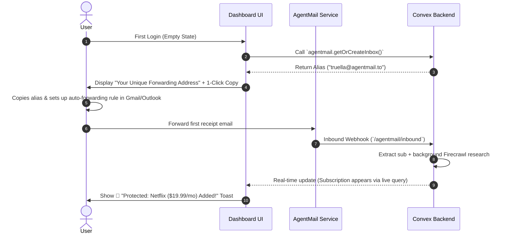

# SubZero — Dashboard Architecture, UX Specification & User Flows

This document provides a comprehensive, production-ready specification for redesigning the **SubZero Dashboard**. It outlines every possible end-to-end user flow, recommended route structures, layout hierarchy, metrics/statistics to display, full CRUD operations, and key UX enhancements.

---

## 🎯 1. Executive Overview & Dashboard Vision

The SubZero Dashboard is an **AI-powered Subscription Protection & Anti-Burn Hub**. Its primary job is to give users **100% clarity over their recurring spend**, warn them *before* money leaves their bank account, and empower them to cancel unwanted subscriptions with verified, zero-friction workflows.

### Core Pillars
1. **Passive Ingestion:** Hands-off collection via forwarded emails (`truella@agentmail.to`) and one-click Gmail API scans.
2. **Active Protection:** Automated renewal warnings (`7d`, `3d`, `24h`) and trial expiration countdowns.
3. **Evidence-Backed Action Engine:** Scraped cancellation routes with step-by-step guidance, pre-filled support emails, and direct cancellation links.

---

## 📊 2. Key Metrics & Statistics (KPI Header Row)

The top of the dashboard should feature a high-impact **Protection & Financial Summary Bar** to provide immediate value upon page load:

| Metric | Calculation / Source | Purpose / Impact |
|---|---|---|
| **Total Monthly Spend** | Sum of all `active` monthly normalized prices | Immediate visibility into monthly recurring burn. |
| **Total Annual Projection** | `(Monthly Spend × 12) + Sum(Yearly Spend)` | Highlight total annual commitment. |
| **Renewing in Next 7 Days** | Count of active subs where `nextRenewalAt <= Date.now() + 7d` | Urgent attention indicator; highlights upcoming charges. |
| **Active Free Trials** | Count of subs where `trialEndsAt > Date.now()` | Prevents accidental trial-to-paid conversions. |
| **Total Money Saved** | Sum of normalized prices for subs marked `cancelled` | Gamifies protection by proving product ROI. |
| **Protection Health Score** | `(Verified Routes / Total Subs) × 100%` | Encourages users to resolve unknown cancellation methods. |

---

## 🗺️ 3. Proposed Route Structure & Layout Hierarchy

### A. Recommended Route Blueprint

```text
/dashboard
├── /dashboard (Overview / Main Grid — Active Subs & Urgent Renewals)
├── /dashboard/subscriptions
│   ├── /dashboard/subscriptions?filter=active
│   ├── /dashboard/subscriptions?filter=trials
│   └── /dashboard/subscriptions?filter=cancelled
├── /dashboard/subscriptions/[id] (Detail Drawer / Full Page view with Evidence Log)
├── /dashboard/actions (Action Center — Pending Cancellations & Pre-filled Drafts)
├── /dashboard/connections (Connected Inboxes, AgentMail Alias & Sync Status)
└── /dashboard/settings (Preferences, Notification Lead-times, Export CSV)
```

### B. Layout Shell Breakdown

```
+-----------------------------------------------------------------------------------+
|  SubZero Logo   |  Search Subs (⌘K)   |  [+ Add Sub]  [Scan Email] |  User Avatar |
+-----------------------------------------------------------------------------------+
| SIDEBAR         |  SUMMARY KPI BAR                                                |
| - Overview      |  [$142/mo] [$1,704/yr] [2 Renewing Soon] [1 Active Trial] [$89 Saved]|
| - Subscriptions |-----------------------------------------------------------------|
| - Action Center |  URGENT ATTENTION BANNER (If Trial Expires < 48h)                |
| - Connections   |-----------------------------------------------------------------|
| - Settings      |  MAIN CONTENT GRID                                              |
|                 |  +------------------------+  +----------------------------------+ |
|                 |  | Renewing Soon (Cards)  |  | All Subscriptions (Table/Grid)   | |
|                 |  +------------------------+  +----------------------------------+ |
+-----------------------------------------------------------------------------------+
```

---

## 🔄 4. Start-to-Finish End-to-End User Flows

### Flow A: Zero-State Onboarding to Protected State


---

### Flow B: Inbound Email Forwarding Ingestion (Passive Flow)
1. **User Action:** User receives a receipt in their personal email and forwards it to `username@agentmail.to`.
2. **Webhook Intake:** `http.ts` receives POST at `/agentmail/inbound`, parses headers (`svix-id`, `to`, `from`), and queues `processForwardedEmail`.
3. **Identity Resolution:** System calls `resolveUserByInbox` to map `to`/`from` against `connections` and `users` tables using persistent `getAuthUserId`.
4. **AI Extraction:** Email body is processed by `extractSubscription` (Groq/OpenAI) to extract `merchant`, `price`, `currency`, `billingInterval`, and `nextRenewalAt`.
5. **Persistence & Deduplication:** `persistExtracted` checks `dedupKey` or `svixId`. If new, inserts into `subscriptions` and `evidence`.
6. **Automatic Research Trigger:** `ctx.scheduler.runAfter(0, internal.research.researchCancellationRoute)` kicks off Firecrawl scraping for cancellation instructions.
7. **UI Experience:** A floating toast notification pops up: *"New subscription detected: ChatGPT Plus ($20/mo)"*. The subscription list reactively updates.

---

### Flow C: Manual Email / Receipt Scan (Active Flow)
1. **User Action:** User clicks **"+ Scan Email / Paste Receipt"** button in topbar or modal trigger.
2. **Modal Opens:** Offers two tabs:
   - *Tab 1: Raw Text Paste* (Paste receipt text directly).
   - *Tab 2: Forwarding Code / Email Alias* (Displays unique forwarding address with copy button & setup guide).
3. **Text Processing:** User pastes raw text $\rightarrow$ clicks **"Extract with AI"**.
4. **Preview Card:** Modal shows live extraction result for verification:
   - Editable fields: Merchant Name, Price, Currency, Interval, Next Renewal Date.
5. **Confirmation:** User clicks **"Save Subscription"**. Sub is saved and automatically scheduled for research and renewal warnings.

---

### Flow D: One-Click Gmail API Historical Scan
1. **User Action:** User navigates to `/dashboard/connections` or clicks **"Connect Gmail for Historical Scan"**.
2. **Scope Consent:** Google OAuth consent requests `gmail.readonly`.
3. **Execution:** User clicks **"Run 30-Day Historical Scan"**.
4. **Progress Feedback:** Modal displays live status bar: *"Scanning 45 messages... Found 3 subscriptions"*.
5. **Results Summary:** Displays breakdown:
   - `Created`: 2 new subscriptions (e.g. Adobe, Canva).
   - `Merged`: 1 existing updated (e.g. Spotify renewal).
   - `Skipped`: 42 non-billing emails.
6. **UI Refresh:** Subscriptions instantly populate the dashboard table.

---

### Flow E: Subscription Inspection & Evidence Deep Dive
1. **User Action:** User clicks on any subscription card/row in the list.
2. **Detail Slide-Over Drawer Opens:**
   - **Header:** Merchant Logo/Icon, Merchant Name, Price, Interval, Status Pill (`Active`, `Renewing Soon`, `Trial`, `Cancelled`).
   - **Key Dates Section:** Next Renewal Date, Days Remaining Counter, Renewal Lead-Time Warnings Status (`7d: Scheduled`, `3d: Scheduled`, `24h: Scheduled`).
   - **Cancellation Guide Section:** Cancellation Method (`open_web`, `send_email`), Difficulty Badge (`Low`, `Medium`, `High`), and step-by-step instructions.
   - **Evidence & Source Log:** Displays the exact text excerpt extracted from the source email/web page, confidence score, source type (`email`, `firecrawl`, `manual`), and timestamp.
3. **User Controls:** Edit subscription details, delete subscription, or trigger manual research refresh.

---

### Flow F: Cancellation Execution (Action Engine Flow)
Depending on the extracted `cancellationMethod`, the user is guided through one of two zero-friction paths:

#### Option 1: Direct Web Link (`open_web` / `open_provider`)
1. User clicks **"Cancel Subscription"**.
2. Modal opens displaying:
   - Step 1: *"Click below to open the official cancellation page."*
   - Step 2: *"Follow steps: Account $\rightarrow$ Subscriptions $\rightarrow$ Cancel Plan."*
   - Exact quote/evidence from merchant support docs.
3. User clicks **"Go to Merchant Cancellation Page"** (opens in new tab).
4. User returns to SubZero modal and clicks **"Mark as Cancelled"**.
5. Subscription status transitions to `cancelled`, annual savings counter increases, and renewal crons are unscheduled.

#### Option 2: Pre-Drafted Support Email (`send_email`)
1. User clicks **"Cancel Subscription"**.
2. Modal displays pre-formatted cancellation email draft:
   - **To:** `support@merchant.com` or `cancellations@merchant.com`
   - **Subject:** `Cancellation Request — Account <user_email>`
   - **Body:** Templated legal cancellation letter requesting immediate termination.
3. User clicks **"Copy Email & Open Mail Client"** (triggers `mailto:` link or copies to clipboard).
4. User clicks **"Mark Cancellation Pending"**. Status updates to `cancellation_pending`.

---

### Flow G: Renewal Warning & Nudge Engine Flow
1. **Milestone Scheduling:** Upon subscription creation, `notifications.ts` schedules 3 milestones (`7d`, `3d`, `24h` before `nextRenewalAt`).
2. **Cron Sweep:** Daily cron (`crons.ts`) or `ctx.scheduler` checks for pending notifications due for delivery.
3. **Delivery:** SubZero sends an outbound email alert via AgentMail:
   - Subject: `⚠️ Netflix renews in 3 days ($19.99)`
   - Body: Clean HTML email with price, renewal date, cancellation difficulty, and a direct button: `[ Cancel via SubZero ]`.
4. **User Return:** Clicking the button in the email deep-links the user directly into the subscription's cancellation drawer on the dashboard.

---

### Flow H: Multi-Inbox & Connections Management Flow
1. **Navigating to Connections:** User clicks **Connections** on the sidebar or opens `/dashboard/connections`.
2. **Inboxes & Accounts UI Card:**
   ```text
   CONNECTED INBOXES & ACCOUNTS
   -----------------------------------------------------------------------
   ✓ truella@agentmail.to        (AgentMail Inbound Alias)   [Copy Alias]
   ✓ alex.personal@gmail.com     (Personal Gmail API)        [Scan Now] [Disconnect]
   ✓ alex.work@company.com       (Google Workspace)          [Scan Now] [Disconnect]

   [+ Connect Another Gmail Account]
   ```
3. **Connecting Secondary Email:**
   - User clicks **"+ Connect Another Gmail Account"**.
   - Triggers Google OAuth popup asking for `gmail.readonly` scope.
   - User completes authentication for `alex.work@company.com`.
   - Backend calls `storeByEmail`, creating a new `connections` record tied to the user's `userId`.
4. **Multi-Account Aggregation:**
   - **Forwarding:** Forwarding receipts from *either* `alex.personal@gmail.com` or `alex.work@company.com` to `truella@agentmail.to` resolves correctly via `resolveUserByInbox`.
   - **Historical Scan:** Clicking **"Scan All Inboxes"** loops through all connected Google accounts, discovering and organizing subscriptions into the single unified dashboard.

---

## 🛠️ 5. Entity CRUD Operations Matrix

| Entity | Create (C) | Read (R) | Update (U) | Delete (D) |
|---|---|---|---|---|
| **Subscriptions** | Inbound Webhook, Gmail Scan, Manual Paste Dialog | Dashboard Grid, Filtered List, Sub Detail Drawer | Edit Price/Interval/Renewal Date, Transition Status (`active` $\rightarrow$ `cancelled`) | Delete Sub Record (removes associated evidence & notifications) |
| **Evidence** | Auto-created during email extraction & Firecrawl research | Rendered inside Sub Detail Drawer under "Evidence Audit Log" | Re-run AI extraction to update quote/confidence | Auto-deleted when parent sub is deleted |
| **Cancellation Actions** | Auto-generated by Research Engine (`convex/research.ts`) | Action Center Drawer / Cancellation Modal | Update instructions or override `cancellationMethod` | Clear Action Step |
| **Notifications** | Auto-scheduled on sub creation/update (`7d`, `3d`, `24h`) | Scheduled Reminders Tab in Settings | Mute specific notification lead-times | Cancel scheduled nudge on sub cancellation |
| **Connections** | Created on auth login (`agentmail`) or Google OAuth (`google`) | `/dashboard/connections` status list | Patch `accountEmail`, refresh tokens | Disconnect Google / Revoke AgentMail alias |

---

## 💡 6. High-Value UX Enhancements & Design Features

### 1. Unified Search & Command Palette (`⌘K` / `Ctrl+K`)
- Allow users to quickly search subscriptions by merchant name, category, or price range.
- Quick actions inside `⌘K`: "Paste Receipt", "Scan Gmail", "Filter by Renewing Soon", "View Cancelled Subs".

### 2. Dual Layout Views: Cards vs. Table Toggle
- **Grid View (Cards):** Visual cards with status dots, difficulty pills, next renewal countdown, and quick-action buttons. Ideal for scanning.
- **Table View:** Compact rows with sortable columns (Merchant, Amount, Interval, Renewal Date, Status, Difficulty, Actions). Ideal for power users managing 10+ subscriptions.

### 3. Smart Alerts & Banners
- **Trial Expiry Banner:** Sticky top banner when a free trial ends in $< 48$ hours.
- **Duplicate Subscription Alert:** Warning banner if two identical merchants or duplicate prices are detected across different channels.

### 4. Interactive Micro-Interactions
- **Status Pills:** Color-coded status dots:
  - 🟢 `Active` (Emerald)
  - 🟡 `Renewing Soon (<7d)` (Amber)
  - 🟣 `Free Trial` (Purple)
  - 🔴 `Action Required / Cancel Pending` (Rose)
  - ⚪ `Cancelled` (Slate)
- **Copy-to-Clipboard Feedback:** Toast feedback when copying forwarding address or cancellation email text.
- **Optimistic UI Updates:** Instant visual state change when marking a subscription as cancelled.

### 5. Seamless Empty States
- **No Subscriptions Yet:** Friendly illustration + clear options:
  - Option 1: *"Forward your first receipt to `username@agentmail.to`"* (with 1-click copy).
  - Option 2: *"Connect Gmail for a 30-second historical scan"*.
  - Option 3: *"Paste a receipt manually"*.

---

## 🚀 7. Recommended Next Steps for UI Developer

1. **Routing Setup:** Create pages under `/dashboard`, `/dashboard/subscriptions`, `/dashboard/connections`, `/dashboard/settings`.
2. **Component Structure:**
   - `<KpiSummaryHeader />`: Top stats row.
   - `<SubscriptionGrid />` & `<SubscriptionTable />`: Main sub views.
   - `<SubscriptionDetailDrawer />`: Slide-over drawer for inspection & evidence logs.
   - `<CancelModal />`: Step-by-step cancellation wizard.
   - `<ScanEmailDialog />`: Text paste + forwarding setup dialog.
3. **Convex Real-Time Hooks:** Wire existing queries (`subscriptions.list`, `subscriptions.needsAttention`, `agentmail.getInbox`, `gmail.getGmailStatus`) directly to UI components for reactive updates.
